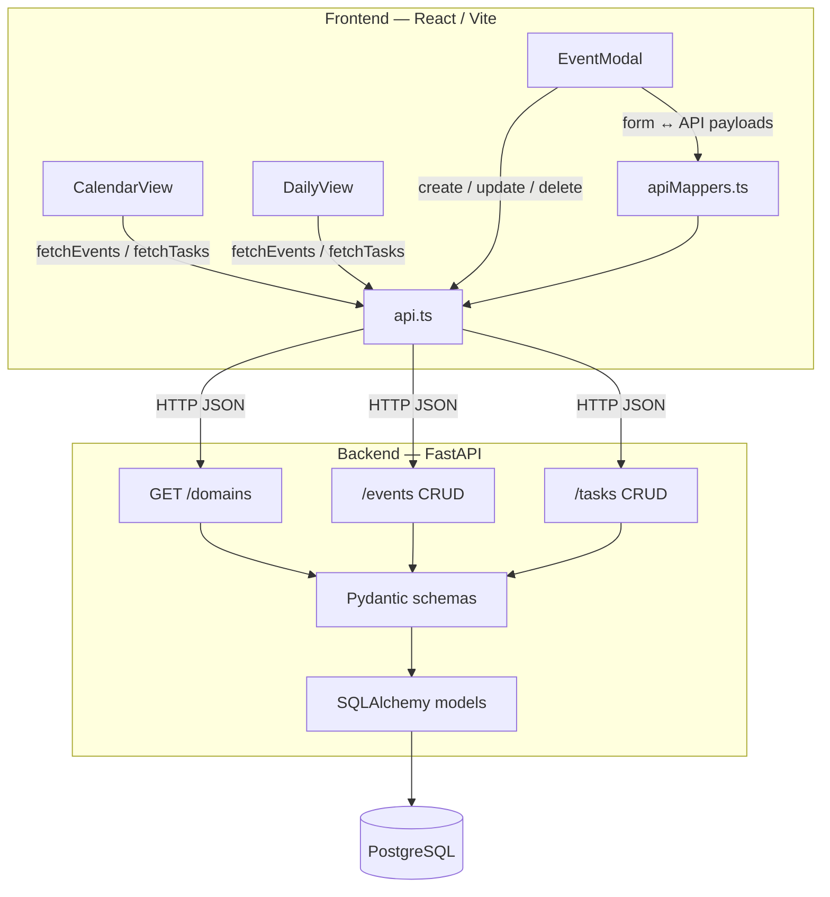
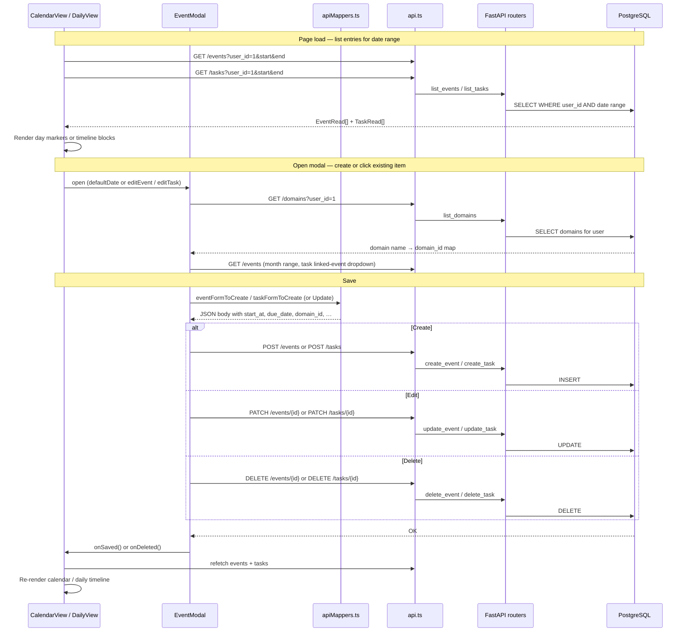

# Data flow

How events and tasks move between the React UI, FastAPI API, and PostgreSQL today (v0.2.0). Auth is not implemented yet — the frontend sends `user_id=1` on every request (dev user seeded by migration `002`).

## Architecture flow

| Layer | Key files |
|-------|-----------|
| Views | `frontend/src/pages/CalendarView.tsx`, `DailyView.tsx` |
| Modal | `frontend/src/modals/EventModal.tsx` |
| Client | `frontend/src/api.ts`, `frontend/src/utils/apiMappers.ts` |
| API | `backend/app/routers/domains.py`, `events.py`, `tasks.py` |
| Validation | `backend/app/schemas/event.py`, `task.py`, `domain.py` |
| Persistence | `backend/app/models/event.py`, `task.py`, `domain.py` |

## CRUD sequence

Typical path when a user opens a view, creates or edits an entry, and sees it reflected in the UI.

## Field mapping (modal → API)

The modal collects human-friendly form fields; `apiMappers.ts` converts them to the backend schema before POST/PATCH.

| Modal field | Event API | Task API |
|-------------|-----------|----------|
| `title` | `title` | `name` |
| `date` + times | `start_at`, `end_at` | `due_date` |
| `allDay` | 00:00 – 23:59 same day | — |
| `domain` (slug) | `domain_id` via GET /domains | `domain_id` |
| `isRecurring` | `is_recurring` | — |
| `linkedEventId` | — | `event_id` |
| — | `user_id: 1` | `user_id: 1` |

## Not wired yet

- Authentication (hardcoded dev user)
- RRULE expansion / recurrence instances
- Objective linking in the UI
- Notes and reminders
